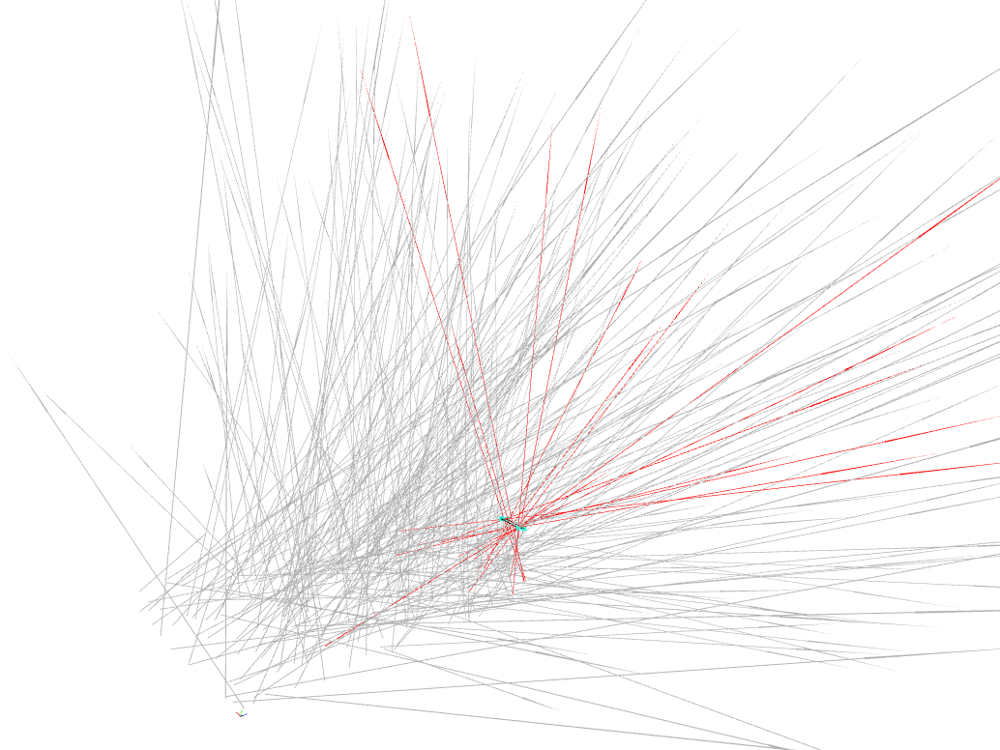
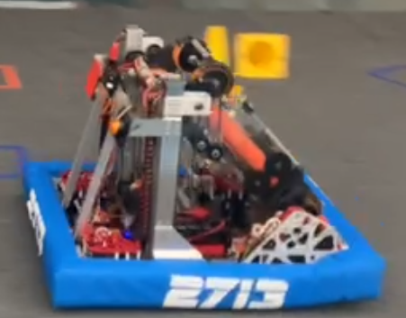
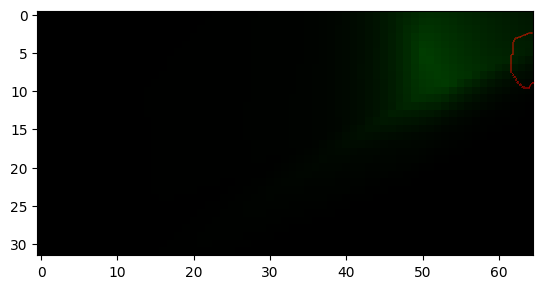

# Shot Prediction

A neural-network based approach to predicting the binary outcome (hit, miss) of shooting an object into a hole or at a
target.

## Introduction

This project provides a neural-network based approach to predicting the binary outcome (in, miss) of shooting an object
into a hole or at a target. The model is trained on a dataset of shots and their outcomes.

## Simulation

The notebook `data_gen.ipynb` contains a simulation of a shooting process. The simulation is based on a linear shot, and
uses raycasting.
Here's an example of the simulation (red = made, blue points are corners of a rectangle representing the goal):

You can grab the data
from [https://huggingface.co/datasets/sid220/2713-2024-shot-prediction/blob/main/raycasting_normalised_angles.csv](https://huggingface.co/datasets/sid220/2713-2024-shot-prediction/blob/main/raycasting_normalised_angles.csv).

## Usage: FRC team 2713's 2024 robot

FRC Team 2713, [Red Hawk Robotics](https://www.thebluealliance.com/team/2713), uses this project to predict the outcomes
of shooting orange rings, or "notes", on their 2024 robot. Their robot includes a pivot shooter and chassis which
functions as a turret.

Data from the robot's sensors will be used as input to the model (later annotated as to whether the shot went in), and
the
model's output will be used to control the robot's position and velocity to make the "optimal shot". For now, data
is [simulated](#Simulation). You can grab the data
from [https://huggingface.co/datasets/sid220/2713-2024-shot-prediction/blob/main/raycasting_normalised_angles.csv](https://huggingface.co/datasets/sid220/2713-2024-shot-prediction/blob/main/raycasting_normalised_angles.csv).
Here's the output of the model when the shot is off the horizon 45 degrees, and the chassis is slightly pointing right,
with the red representing the rough location of the goal:

Training is fairly simple, and can be found in `train.ipynb`.
